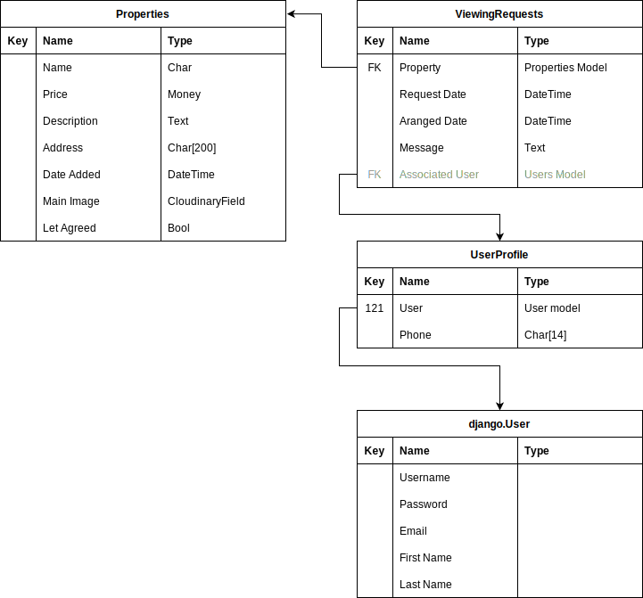

<h1 align="center">Pro Lettings</h1>

[View the live project here.](https://pro-letting.herokuapp.com/)

# Table of content

+ [Design Process](#design-process)
+ [Features](#features)
+ [Technologies](#technologies-used)
+ [Testing](#testing)
+ [Deployment](#deployment)
+ [Credits](#credits)

***

## Design Process

-   ### Application Aim
    The site aims to be the main bridge between the client and the agency.

    From the agency standpoint, it mainly helps the agency's work by alleviating the manual creation of customer data and scheduling meetings according to staff availability.

    Customers looking to rent or to let are provided with valuable information on the services offered. Each client must register to have access to the site features, and for ease of access, registrations are built-in while requesting an appointment.

    Customers looking to rent a property can browse through the available properties. In addition, each booked appointment for a property is available in the client's dashboard, where they can book, amend, or cancel a meeting.

-   ### Opportunities

Opportunity | Importance | Viability/Feasibility
---|---|---
Landing Page | 5 | 5
Property browser | 5 | 4
Detailed property View | 3 | 5
Request viewing | 5 | 5
Show available time-slots for viewings | 4 | 3
Register account | 5 | 4
Personal collection board | 4 | 3
Offer registration while/after booking a viewing | 3 | 4
Receive 'notifications' by email option | 2 | 3
Property owner specific page | 5 | 5
Property owner request appointment | 5 | 5
Property owner registration | 2 | 3
Property owner dashboard | 2 | 2
Manager/employee dashboard | 5 | 4
Respond to viewing/appointment request form | 3 | 3
Managers employee overview dashboard | 3 | 2
Employee appointment schedule calendar | 4 | 2
Add notes to clients | 4 | 3
Search by location | 4 | 1
Zoopla API integration | 1 | 1
Other unrealized services to mention | ? | ?
**Total** | 68 | 66

-   ### Scope
    Due to time constraints and the steep learning curve of Django the project divided to Sprints where each aims for a MVP:
    1. Sprint:
        -   create the properties model
        -   create the employees model
        -   the landing page  with minimal content, the site heading with navigation, default css framework design, and navigation to the following pages:
            -   property browser page
            -   property owner page
        -   request property viewing for tenants
        -   account registration
        -   manager/employee admin access
        -   property owner page and contact form
        -   tests

    2. Sprint:
        -   personalize ui design
        -   user dashboard
        -   detailed property view
        -   browse order-by price low-to-high and vice versa
        -   amend and cancel viewing
        -   employee appointment schedule
            -   show available time-slots when booking a viewing
            -   employee login

-   ### Agile Approach
    1.   #### Sprint - Epics & Tasks:

        1.  Base template:
            -   Navigation
            -   Footer
        1.  Landing page:
            -   Hero img and quick access the browse properties
            -   Welcome, detailed navigation buttons
            -   About and contact details
            -   Renting flow diagram - fetch block to lazy load this content?
        1.  Property browser page:
            -   display the available properties
            -   book viewing button (and request further info on property for *this Sprint*)
            -   property-picture, price and details card
        1.  Authentication and user registration:
            -   Login
            -   Register
        1.  Owner and staff access to admin
        1.  Property owner page:
            -   book an appointment
            -   B2B info
            -   freedom theme parallax picture
            -   informative list of discussion details
    
-   ### User Stories
    Find it also in the project [GitHub issues](https://github.com/spanifer/pp4-fullstack/issues)
    -   New user:
        -   As a **new user** I can **arrive on the site** so that **I can have quick access to the main features and comprehensive details of usage**
        -   As a **new user** I can **go through the list of available properties** so that **I can look for a suitable property with details to rent**
        -   As a **new user** I can **contact the agency by filling out a form with my details** so that **I can request a viewing on a selected property**
    -   Registered user:
        -   As a **registered user** I can **login with an existing account** so that **I can book appointments**
    -   Owner/staff user:
        -   As the **owner** I can **access the admin pages** so that **I can add employees as staff users**
        -   As the **owner/employee** I can **review and respond to a potential tenant who requested a viewing** so that **we can arrange a meeting and come to an agreement**
        -   As the **owner** I can **add notes to each client** so that **I can provide a personalized experience for clients and adept for their needs**

    -   User stories dropped:
        -   As a **new user** I can **register an account with my details required to book an appointment** so that **I can request a booking without needing to register beforehand**
        -   As a **registered user** I can **choose to allow the site** to **automatically email me if one of my saved listings has a price change or is no longer available**

-   ### Wireframes

    [Landing page](docs/wireframes/Home.small.png):

    

    [Property browser](docs/wireframes/PropertyBrowser.small.png):

    

-   ### Data Model

    

-   ### Surface

## Features
<a href="#table-of-content">Go back 🔝</a>

### Future Features

## Technologies Used
<a href="#table-of-content">Go back 🔝</a>

### Languages Used
-   [HTML & CSS](https://www.w3.org/standards/webdesign/htmlcss)
-   [Python](https://en.wikipedia.org/wiki/Python_(programming_language))

### Frameworks, Libraries & Programs Used

1. [Git](https://git-scm.com/)
1. [GitHub](https://github.com/)
1. [Django](https://www.djangoproject.com/)
1. [Materialize Css](https://materializecss.com/)
1. [draw.io](https://www.diagrams.net/)
1. [PostgreSQL](https://www.postgresql.org/)

## Testing
<a href="#table-of-content">Go back 🔝</a>

### Validators Testing
-   [W3C Markup Validator](https://jigsaw.w3.org/css-validator/#validate_by_input)
-   [W3C CSS Validator](https://jigsaw.w3.org/css-validator/#validate_by_input)
-   [Python](http://pep8online.com/)

### Testing User Stories

### Further Testing

### Known Bugs

-   message on logout not sent / received

### Other mentions

-   for deployment, found information on [heroku documentation](https://devcenter.heroku.com/articles/slug-compiler#ignoring-files-with-slugignore) about `.slugignore`. Files and folders can be listed in this file that are not required for deployment, similar to `.gitignore` structure

## Deployment
<a href="#table-of-content">Go back 🔝</a>

The project was deployed on [Heroku](https://www.heroku.com/) and static and media files served from [Cloudinary](https://cloudinary.com/).

-   Steps for deployment:
    -   Fork or clone this repository
    -   Create a new Heroku app
    -   Create a Cloudinary account and from the dashboard copy the *API Environment variable*
    -   In the dashboard overview add Postgres add-on
    -   In the app settings:
        -   Set the buildpacks to `Python`
        -   Add the following configs:
            -   `PORT`:`8000`
            -   `DEVELOPMENT`:`False` - **IMPORTANT**! This also turns DEBUG OFF
            -   `SECRET_KEY`:`_replace_with_secret`
            -   `CLOUDINARY_URL`:`_replace_with_copied_cloudinary_url`
    -   Rename `env.template.py` file to `env.py` file in project directory
        -   Replace each value with the corresponding Heroku config vars
        -   Set `os.environ.setdefault("DEVELOPMENT", "False")`
    -   In the django project setting:
        -   Add the heroku project url to `ALLOWED_HOSTS` list
    -   Run `python3 manage.py migrate`
    -   Using the Heroku CLI, login with heroku user following the prompt of `heroku login -i`
    -   Run `git push heroku main`

## Credits
<a href="#table-of-content">Go back 🔝</a>

### Code
- ~~to enable user authentication with email address instead of username I have followed [this article](https://www.fomfus.com/articles/how-to-use-email-as-username-for-django-authentication-removing-the-username/)~~

### Acknowledgements

-   README.md structure inspired by several Code Institute's samples